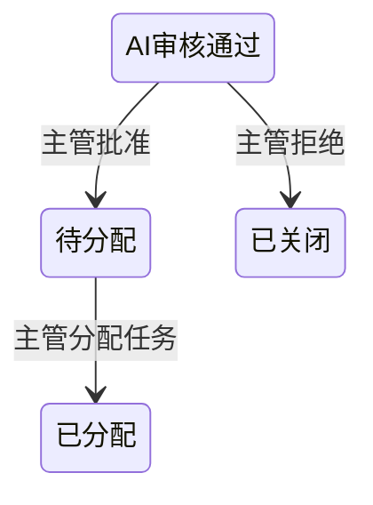

# 主管审核与任务分配功能 - 设计文档

## 1. 功能描述
本功能模块是NEPM（后台管理端）的核心组成部分，专为`主管 (SUPERVISOR)`和`管理员 (ADMIN)`角色设计。它弥合了AI自动审核与人工任务分配之间的鸿沟，确保了只有经过人工确认的有效反馈才能进入网格员的处理流程。

主要职责包括：
- **审核**: 对AI初审通过的反馈 (`PENDING_REVIEW`) 进行人工复核。
- **决策**: 决定该反馈是应该继续流转 (`PENDING_ASSIGNMENT`) 还是直接关闭 (`CLOSED_INVALID`)。
- **分配**: 将审核通过的有效反馈手动指派给特定的`网格员 (GRID_WORKER)`。

## 2. 业务流程
```mermaid
graph TD
    subgraph "AI自动审核"
        A[反馈状态: PENDING_REVIEW]
    end

    subgraph "主管人工审核 (Supervisor/Admin 操作)"
        A --> B{主管查看待审核列表};
        B --> C{审核决策};
        C -- 审核通过 --> D[调用 Approve API<br>/api/supervisor/reviews/{id}/approve];
        C -- 审核拒绝 --> E[调用 Reject API<br>/api/supervisor/reviews/{id}/reject];
    end

    subgraph "后端服务"
        D --> F[反馈状态变为<br>PENDING_ASSIGNMENT];
        E --> G[反馈状态变为<br>CLOSED_INVALID];
    end

    subgraph "主管手动分配"
        F --> H{主管在任务分配界面<br>查看待分配列表};
        H --> I{选择反馈 + 选择网格员};
        I --> J[调用 Assign API<br>/api/task-assignment/assign];
    end
    
    subgraph "后端服务"
        J --> K[创建 Assignment 记录<br>反馈状态变为 ASSIGNED];
    end

    style F fill:#C8E6C9,stroke:#333
    style G fill:#FFCDD2,stroke:#333
    style K fill:#B3E5FC,stroke:#333
```

## 3. API 接口设计

### 3.1 主管审核接口 (SupervisorController)

#### 3.1.1 获取待审核反馈列表
- **URL**: `GET /api/supervisor/reviews`
- **描述**: 获取所有状态为 `PENDING_REVIEW` 的反馈，供主管进行人工审核。
- **权限**: `SUPERVISOR`, `ADMIN`
- **成功响应** (`200 OK`): 返回 `Feedback` 对象数组。
    ```json
    [
      {
        "id": 101,
        "eventId": "uuid-...",
        "title": "...",
        "status": "PENDING_REVIEW",
        ...
      }
    ]
    ```

#### 3.1.2 批准反馈
- **URL**: `POST /api/supervisor/reviews/{feedbackId}/approve`
- **描述**: 主管批准一个反馈，使其进入待分配状态。
- **权限**: `SUPERVISOR`, `ADMIN`
- **路径参数**: `feedbackId` (Long) - 要批准的反馈ID。
- **成功响应** (`200 OK`): 无内容。
- **失败响应**:
    - `400 Bad Request`: 如果反馈状态不是 `PENDING_REVIEW`。
    - `404 Not Found`: 如果 `feedbackId` 不存在。

#### 3.1.3 拒绝反馈
- **URL**: `POST /api/supervisor/reviews/{feedbackId}/reject`
- **描述**: 主管拒绝一个反馈，将其关闭。
- **权限**: `SUPERVISOR`, `ADMIN`
- **路径参数**: `feedbackId` (Long) - 要拒绝的反馈ID。
- **成功响应** (`200 OK`): 无内容。
- **失败响应**:
    - `400 Bad Request`: 如果反馈状态不是 `PENDING_REVIEW`。
    - `404 Not Found`: 如果 `feedbackId` 不存在。


### 3.2 任务分配接口 (TaskAssignmentController)

#### 3.2.1 获取待分配反馈列表
- **URL**: `GET /api/task-assignment/unassigned-feedback`
- **描述**: 获取所有状态为 `PENDING_ASSIGNMENT` 的反馈，即已通过主管审核，等待分配。
- **权限**: `SUPERVISOR`, `ADMIN`
- **成功响应** (`200 OK`): 返回 `Feedback` 对象数组。

#### 3.2.2 获取可用网格员列表
- **URL**: `GET /api/task-assignment/available-workers`
- **描述**: 获取所有角色为 `GRID_WORKER` 的用户列表，用于分配任务时的选择器。
- **权限**: `SUPERVISOR`, `ADMIN`
- **成功响应** (`200 OK`): 返回 `UserAccount` 对象数组。

#### 3.2.3 分配任务
- **URL**: `POST /api/task-assignment/assign`
- **描述**: 将一个反馈任务指派给一个网格员。
- **权限**: `SUPERVISOR`, `ADMIN`
- **请求体**:
    ```json
    {
      "feedbackId": 101,
      "assigneeId": 205
    }
    ```
- **成功响应** (`201 Created`): 返回新创建的 `Assignment` 对象。
- **失败响应**:
    - `400 Bad Request`: 如果反馈状态不是 `PENDING_ASSIGNMENT` 或用户不是网格员。
    - `404 Not Found`: 如果 `feedbackId` 或 `assigneeId` 不存在。

## 4. 状态机详解
