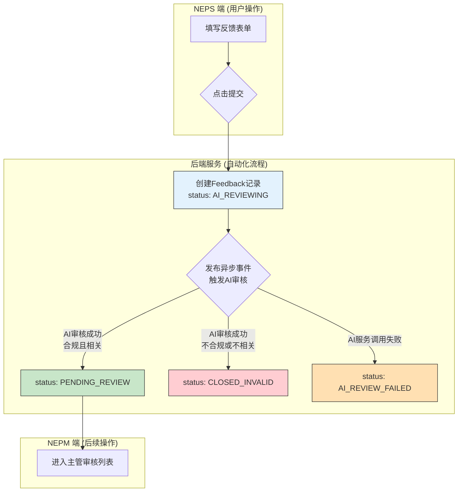

# 公众反馈功能 - 设计文档

## 1. 功能描述
本功能是系统面向公众的核心入口（NEPS端），允许公众监督员提交图文并茂的空气质量问题反馈。提交后，系统将**异步调用AI服务**对反馈内容进行审核，最终将有效反馈转化为待处理的任务，送入内部管理流程。

## 2. 涉及角色
- **主要使用者**: `公众监督员 (PUBLIC_SUPERVISOR)` 或任何已认证用户
- **间接关联者**: `主管 (SUPERVISOR)` (作为反馈的接收和处理者)

## 3. 业务规则

### 3.1 提交规则
- 用户必须处于**已认证 (Authenticated)** 状态才能提交反馈。
- 提交时，`标题`、`污染类型`、`严重等级`、`地理位置`为必填项。
- 地理位置通过前端组件获取，同时生成`文字地址`和`地理坐标(经纬度)`，一并提交给后端。

### 3.2 AI处理规则
- **模型**: 所有AI处理均调用火山引擎的大语言模型API。
- **触发方式**: 用户提交反馈后，系统立即将反馈状态置为 `AI_REVIEWING`，并发布一个**异步事件**来触发AI审核，不会阻塞用户的提交操作。
- **审核逻辑**: AI服务会对用户提交的`标题`、`描述`和`图片`进行**单阶段审核**，通过Function Calling能力，**同时判断**以下两点：
    -   `is_compliant`: 内容是否合规（不含敏感词等）。
    -   `is_relevant`: 内容是否与大气污染问题相关。
- **输出**:
    - 若AI判断为**合规且相关**，则反馈状态更新为 `PENDING_REVIEW`。
    - 若AI判断为**不合规或不相关**，则反馈状态更新为 `CLOSED_INVALID`。
    - 若AI服务调用**失败**（如网络异常、API错误），则反馈状态更新为 `AI_REVIEW_FAILED`，以便后续人工介入或重试。

### 3.3 事件ID规则
- 反馈创建时，系统后端自动使用 `UUID.randomUUID().toString()` 生成一个唯一的字符串作为 `eventId`。

## 4. 功能实现流程


## 5. API 接口设计

### 5.1 提交反馈接口

- **URL**: `POST /api/feedback/submit`
- **描述**: 用户提交新的环境问题反馈。
- **权限**: `isAuthenticated()` (任何已认证用户)
- **请求类型**: `multipart/form-data`
- **请求体**:
    - `feedback` (JSON字符串，DTO: `FeedbackSubmissionRequest`):
        ```json
        {
          "title": "长安区工业园附近空气异味严重",
          "description": "每天下午都能闻到刺鼻的气味...",
          "pollutionType": "OTHER",
          "severityLevel": "HIGH",
          "location": {
             "latitude": 38.04,
             "longitude": 114.5
          }
        }
        ```
    - `files` (File数组): 用户上传的图片文件（可选）。
- **成功响应** (`201 Created`):
    - 返回创建的 `Feedback` 实体JSON对象，其中包含由后端生成的`id`和`eventId`(UUID格式)。

- **失败响应**:
    - `400 Bad Request`: 表单验证失败。
    - `401 Unauthorized`: 用户未登录。
    - `413 Payload Too Large`: 上传文件过大。
    - `500 Internal Server Error`: 服务器内部错误。

## 6. 状态机详解
```mermaid
stateDiagram-v2
    [*] --> AI_REVIEWING: 用户提交

    AI_REVIEWING --> PENDING_REVIEW: AI审核通过
    AI_REVIEWING --> CLOSED_INVALID: AI审核拒绝 (内容问题)
    AI_REVIEWING --> AI_REVIEW_FAILED: AI审核失败 (技术问题)
    
    PENDING_REVIEW: 待主管审核
    CLOSED_INVALID: 已关闭/无效
    AI_REVIEW_FAILED: AI审核失败

    state PENDING_REVIEW {
        note right of PENDING_REVIEW
            此状态的反馈将出现在
            主管的管理界面中，
            等待人工处理。
        end note
    }
```

## 7. 错误处理与边界情况
| 场景 | 触发条件 | 系统处理 | 用户提示 |
| :--- | :--- | :--- | :--- |
| **表单验证失败** | 必填项为空或格式不正确 | 后端返回`400`错误，不创建记录 | 在对应表单项下方显示红色错误提示 |
| **文件上传失败** | 文件过大、格式不支持、网络中断 | 后端返回`413`或`500`错误 | 弹出全局错误消息："图片上传失败，请稍后重试" |
| **AI服务调用异常**| AI接口超时或返回错误码 | ① `AiReviewService`捕获异常<br>② 将反馈状态设置为`AI_REVIEW_FAILED`并保存<br>③ 流程终止，等待人工处理 | 对用户无感知，后台自动处理 |
| **用户重复提交** | 用户快速点击提交按钮 | 前端在点击后禁用按钮并显示加载动画；<br>后端对相同用户的请求在短时间内进行幂等性处理 | "正在提交，请稍候..." |

## 8. 界面与交互细节

### 8.1 反馈提交页面 (NEPS)
- **表单设计**:
    - `标题`: 单行文本输入框。
    - `描述`: 多行文本域，允许输入较长内容。
    - `污染类型`: **单选框 (Radio Group)** 或 **下拉选择框 (Select)**，选项为`PM2.5`, `O3`, `NO2`, `SO2`, `OTHER`。
    - `严重等级`: **单选框 (Radio Group)**，选项为`高`, `中`, `低`，并附有简单的解释说明。
    - `地理位置`: 提供一个地图选点组件，用户点击地图即可自动填充文字地址和网格坐标。也应允许用户手动输入地址。
    - `照片上传`: 提供一个图片上传组件，支持多选、预览和删除已上传的图片。**明确提示支持的格式（JPG, PNG）和大小限制**。
- **交互细节**:
    - **加载状态**: 点击"确认提交"后，按钮变为"提交中..."并显示加载动画，同时整个表单区域置为不可编辑状态。
    - **成功提示**: 提交成功后，弹出一个全局成功的消息提示（e.g., "提交成功！感谢您的反馈。")，并自动跳转到反馈历史页面。
    - **失败提示**: 如果提交失败，根据错误类型给出明确的全局错误提示，并保持表单内容，让用户可以修改后重新提交。

### 8.2 反馈历史页面 (NEPS)
- 以列表形式展示用户所有提交过的反馈。
- 每个列表项应以卡片形式展示，包含`标题`, `提交时间`, `事件ID`, 和一个醒目的**`状态标签`**。
- **状态标签**:
    - `待审核`: 蓝色或灰色
    - `待分配`: 橙色
    - `已分配`/`处理中`/`已提交`/`已完成`: 绿色
    - `已作废`/`已取消`: 红色
- 点击卡片可进入反馈详情页，查看所有提交信息、`事件ID`和处理流程的详细时间线。
- 对于状态为`PENDING_REVIEW`或`PENDING_ASSIGNMENT`的反馈，详情页提供"撤销提交"按钮。点击后需**二次确认弹窗**，防止误操作。 