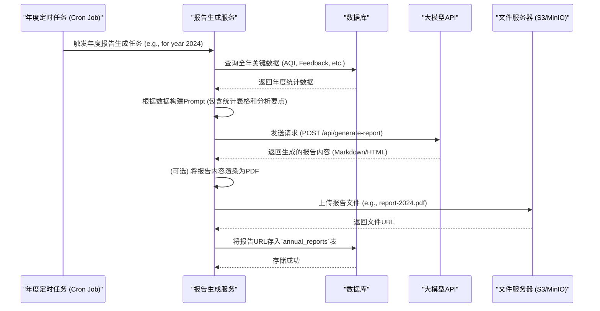

# 决策者大屏功能 - 设计文档

## 1. 功能描述
本功能模块是专为决策者和高级管理员（NEPV端）设计的全局态势感知中心。它通过一系列数据可视化图表、关键绩效指标（KPI）和地图，将系统采集和处理的海量数据，转化为直观、易于理解的宏观洞察，旨在为环保工作的战略规划和决策提供强有力的数据支持。

## 2. 涉及角色
- **主要使用者**: `决策者 (DECISION_MAKER)`
- **次要使用者**: `系统管理员 (ADMIN)` (需要访问以进行日常运营监控)

## 3. 业务规则

### 3.1 权限与数据规则
- **完全只读**: 大屏上的所有元素均为只读，不提供任何数据修改、删除或提交的入口。
- **数据聚合性**: 除非特殊说明，大屏展示的数据均为聚合后的统计结果（如区域平均值、月度总数），不暴露任何单个反馈或用户的详细隐私信息。
- **实时性**: 部分KPI指标（如"今日新增反馈"）要求准实时更新，后端需提供高效的查询接口。大部分统计图表数据可通过后台定时任务（如每小时或每日）预计算并缓存，以提升加载性能。
- **实时性与缓存**: 
  - **实时数据**: 关键KPI指标（如"今日新增反馈"）和实时检测数量图，应通过WebSocket或短轮询实现准实时更新。
  - **缓存策略**: 大部分统计图表（如月度趋势、类型分布）的数据应由后端的定时任务（如每小时）预先计算，并存储在Redis等内存数据库中。前端请求API时，直接从缓存读取，极大提升加载速度。缓存的Key设计应包含日期和区域等维度，例如`dashboard:aqi_trend:2024-07`。
  - **缓存失效**: 定时任务在生成新数据后，会覆盖旧的缓存，实现自动更新。

### 3.2 核心组件数据来源
- **KPI指标卡**: 直接查询数据库，对`feedback`和`user_account`等表进行快速COUNT或AVG聚合。
- **统计图表 (趋势图、分布图)**: 由后端的聚合服务，基于`aqi_data`和`feedback`表，按指定维度（时间、类型）进行GROUP BY计算后生成。
- **污染源热力图**: 后端聚合`feedback`表中的`grid_x`, `grid_y`坐标和`severityLevel`，生成一个包含坐标和权重的数据集，供前端渲染。数据同样需要被缓存。
- **AI年度报告**:
  - 由一个年度批处理任务（Cron Job）在每年年底或次年年初自动触发。
  - 该任务负责从数据库抽取全年关键统计数据，形成一份综合材料。
  - 调用`deepseek-v3-250324`大模型API，将结构化的统计数据和分析要点作为Prompt，生成一份图文并茂的分析报告。
  - 生成的报告（如PDF或Markdown格式）存储在文件服务器上，大屏端仅提供一个下载链接。

### 3.3 交互设计规则
- **全局筛选**: 在大屏顶部或侧边提供全局筛选控件，至少包括 **时间范围选择器**（如"近7天", "本月", "本年", 自定义范围）和 **区域选择器**（当下钻到省市级别时）。所有组件都应响应这些筛选条件的变化。
- **图表联动与下钻**:
  - **联动**: 点击饼图的某个扇区（如"工业污染"），其他图表（如AQI趋势图、热力图）应能自动筛选并重新渲染，仅显示与"工业污染"相关的数据。
  - **下钻**: 在地图或区域排行榜上，点击某个省份，可以下钻到该省的市级数据视图。此时，应有明显的面包屑导航提示当前所处的层级（如"全国 > 浙江省"）。

## 4. 功能实现流程

### 4.1 数据流架构
```mermaid
graph TD
    subgraph "数据源 (DB)"
        A[aqi_data]
        B[feedback]
        C[user_account]
    end

    subgraph "数据处理层"
        D[定时聚合服务 (Cron Job)]
        E[实时API服务]
        F[<br><br><b>缓存 (Redis)</b><br><br>]
    end

    subgraph "前端大屏 (NEPV)"
        G[KPI 指标卡]
        H[AQI 趋势图]
        I[污染类型分布图]
        J[污染源热力图]
        K[年度报告下载]
        L[WebSocket 连接]
    end
    
    A & B & C --> D
    D --> F
    B & C --> E

    E -- 实时查询 --> G
    E -- 建立长连接 --> L
    L -- 推送实时数据 --> G

    F -- 读取缓存 --> H
    F -- 读取缓存 --> I
    F -- 读取缓存 --> J

    subgraph "AI服务"
        M[AI报告生成服务 (Annual Cron)]
        N[大模型 API]
        O[文件服务器]
    end

    A & B & C --> M
    M --> N
    N --> M
    M --> O
    O --> K
```

### 4.2 AI年度报告生成时序图


## 5. API 接口设计

### 5.1 KPI 指标接口
- **URL**: `GET /api/data-v/kpis`
- **查询参数**: `?timeRange=...&area=...`
- **响应**: `200 OK`, 返回 `[{ "title": "累计反馈总数", "value": 1024, "change": "+5%" }, ...]`

### 5.2 图表数据接口 (通用)
- **URL**: `GET /api/data-v/chart`
- **查询参数**: `?name=aqiTrend&timeRange=...&area=...` (name用于指定图表类型)
- **响应**: `200 OK`, 返回符合ECharts等图表库格式要求的数据结构。

### 5.3 热力图数据接口
- **URL**: `GET /api/data-v/heatmap`
- **查询参数**: `?timeRange=...&area=...`
- **响应**: `200 OK`, 返回 `[{ "lng": 120.15, "lat": 30.28, "count": 95 }, ...]`

### 5.4 实时数据推送
- **WebSocket**: `ws://your-domain/api/data-v/realtime`
- **推送消息格式**: `{ "type": "newFeedback", "data": { ... } }` or `{ "type": "kpiUpdate", "data": { ... } }`

## 6. 界面设计要求

### 6.1 整体布局与风格
- **主题**: 采用深色科技感主题（如深蓝色、暗灰色背景），以突出数据图表的色彩。
- **布局**: 基于`1920x1080`分辨率进行设计，采用栅格系统（如24列）进行灵活布局，确保在主流大屏上不变形。
- **组件**: 所有可视化组件（Widgets）以卡片形式组织，每个卡片都有清晰的标题。
- **交互性**: 所有图表在鼠标悬浮时应显示详细的Tooltip提示。支持点击事件，用于图表间的联动和下钻。
- **技术选型**: 推荐使用成熟的图表库，如`ECharts`或`AntV`，来实现高质量的可视化效果。

### 6.2 核心可视化组件详解

- **顶部 - KPI指标行 & 全局筛选器**:
  - 在屏幕顶端横向排列4-6个核心指标卡。
  - 指标行旁边或下方设置全局筛选器，包括时间范围和区域选择。
  - 每个卡片包含一个醒目的图标、一个加粗的巨大数值、和一个清晰的指标名称（如"累计反馈总数"、"当前活跃网格员"、"本月平均AQI"）。

- **中部 - 可交互的污染源热力图**:
  - **需求**: 在地图上查看可视化污染源热力图。
  - **呈现形式**: 占据屏幕最大面积的核心组件。在二维网格地图上，根据各网格内高严重等级反馈的数量和权重，用不同的颜色（如从蓝色到红色）渲染，形成热力效果。地图应支持基本的缩放和拖拽操作。

- **图表组件 - 左侧面板**:
  - **空气质量超标趋势图 (折线图)**:
    - **需求**: 查看过去12个月的空气质量超标趋势。
    - **呈现形式**: X轴为过去12个月份，Y轴为超标天数或超标事件次数。用平滑的曲线展示AQI超标趋势，并可提供与去年同期的对比线。
  - **总AQI及分项污染物超标统计 (柱形图)**:
    - **需求**: 查看总AQI及各分项污染物浓度超标的累计统计。
    - **呈现形式**: X轴为污染物类型（总AQI, PM2.5, O3, NO2, SO2等），Y轴为本年度累计超标次数。每个污染物为一根柱子，清晰对比。

- **图表组件 - 右侧面板**:
  - **AQI级别分布图 (饼图)**:
    - **需求**: 查看AQI级别分布。
    - **呈现形式**: 标准饼图，将AQI数据按标准（优、良、轻度污染、中度污染、重度污染、严重污染）划分，展示各级别占比。
  - **各省市网格覆盖率 (饼图)**:
    - **需求**: 查看各省市的网格覆盖率。
    - **呈现形式**: 饼图展示已覆盖与未覆盖网格的**总体比例**。为获得更佳体验，可提供下钻功能或辅以排行榜/地图着色展示各省市详情。
  - **实时空气质量检测数量 (实时折线图)**:
    - **需求**: 查看实时的空气质量检测数量统计。
    - **呈现形式**: X轴为过去24小时，Y轴为该时段内完成的AQI检测数，线条实时或准实时更新。
  - **AI年度报告下载**:
    - 一个简洁的卡片，包含报告年份，和一个醒目的"下载报告"按钮。 