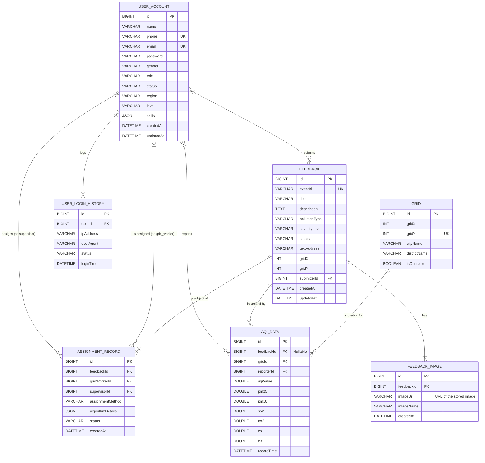

# 东软环保公众监督系统 - 数据库设计文档

## 1. 设计概述
本数据库设计旨在支持一个高效、可扩展的环保监督系统。设计遵循第三范式（3NF），通过主外键关联确保数据的一致性和完整性。所有表均采用`InnoDB`存储引擎，以支持事务和行级锁定。

- **命名规范**: 表名采用小写下划线命名法（e.g., `user_account`），字段名采用驼峰命名法（e.g., `createdAt`）。
- **主键**: 所有表均包含一个`BIGINT`类型的自增主键`id`。
- **时间戳**: 关键业务表包含`createdAt`和`updatedAt`字段，用于追踪记录的创建和最后修改时间。

## 2. 实体关系图 (E-R Diagram)

## 3. 数据表详细设计

### 3.1 用户表 (`user_account`)
存储所有系统用户，包括公众、监督员、网格员、管理员和决策者。

| 字段名 | 数据类型 | 长度/约束 | 是否可空 | 默认值 | 描述 |
| :--- | :--- | :--- | :--- | :--- | :--- |
| `id` | `BIGINT` | `PK, AUTO_INCREMENT`| No | | 唯一主键 |
| `name` | `VARCHAR`| 255 | No | | 真实姓名 |
| `phone` | `VARCHAR`| 50 | No | | 手机号 (唯一，用于登录) |
| `email` | `VARCHAR`| 255 | No | | 邮箱 (唯一，用于登录和验证) |
| `password`| `VARCHAR`| 255 | No | | BCrypt加密后的密码 |
| `gender` | `VARCHAR`| 10 | Yes | | 性别 (Enum: `MALE`, `FEMALE`, `UNKNOWN`) |
| `role` | `VARCHAR`| 50 | No | `PUBLIC_SUPERVISOR` | 角色 (Enum: `PUBLIC_SUPERVISOR`, `SUPERVISOR` (业务主管), `GRID_WORKER` (网格员), `ADMIN` (系统管理员), `DECISION_MAKER` (决策者)) |
| `status` | `VARCHAR`| 50 | No | `ACTIVE`| 账户状态 (Enum: `ACTIVE`, `INACTIVE`, `ON_LEAVE`) |
| `region` | `VARCHAR`| 255| Yes | | 所属区域 (格式: "省-市-区") |
| `level` | `VARCHAR`| 50 | Yes | | 行政级别 (Enum: `PROVINCE`, `CITY`) |
| `skills` | `JSON` | | Yes | | 技能标签 (仅对网格员有效, e.g., `["PM2.5", "O3"]`) |
| `createdAt` | `DATETIME` | | No | `CURRENT_TIMESTAMP` | 创建时间 |
| `updatedAt` | `DATETIME` | | No | `CURRENT_TIMESTAMP ON UPDATE CURRENT_TIMESTAMP` | 更新时间 |

**索引设计**:
- `PRIMARY KEY (id)`
- `UNIQUE KEY uk_phone (phone)`
- `UNIQUE KEY uk_email (email)`
- `KEY idx_role_status (role, status)`
- `KEY idx_region_level (region, level)`

### 3.2 反馈信息表 (`feedback`)
存储由公众监督员提交的污染反馈信息。

| 字段名 | 数据类型 | 长度/约束 | 是否可空 | 默认值 | 描述 |
| :--- | :--- | :--- | :--- | :--- | :--- |
| `id` | `BIGINT` | `PK, AUTO_INCREMENT`| No | | 唯一主键 |
| `eventId`| `VARCHAR`| 255 | `UK, NOT NULL` | | 业务事件ID (USR...格式)，对用户可见、唯一 |
| `title` | `VARCHAR`| 255 | No | | 反馈标题 |
| `description`| `TEXT` | | Yes | | 详细描述 |
| `pollutionType`|`VARCHAR`| 50 | No | | 污染类型 (Enum: `PM2.5`, `O3`, `NO2`, `SO2`, `OTHER`) |
| `severityLevel`|`VARCHAR`| 50 | No | | 严重等级 (Enum: `LOW`, `MEDIUM`, `HIGH`) |
| `status` | `VARCHAR`| 50 | No | `AI_REVIEWING`| 任务状态 (Enum: `AI_REVIEWING`, `AI_PROCESSING`, `PENDING_ASSIGNMENT`, `ASSIGNED`, `IN_PROGRESS`, `SUBMITTED`, `COMPLETED`, `CANCELLED`, `CLOSED_INVALID`) |
| `textAddress`| `VARCHAR`| 255 | Yes | | 文字地址 (格式: "省份-城市-区") |
| `gridX` | `INT` | | Yes | | 对应的网格X坐标 |
| `gridY` | `INT` | | Yes | | 对应的网格Y坐标 |
| `submitterId`| `BIGINT` | `FK -> user_account.id` | No | | 提交者ID |
| `createdAt` | `DATETIME` | | No | `CURRENT_TIMESTAMP` | 创建时间 |
| `updatedAt` | `DATETIME` | | No | `CURRENT_TIMESTAMP ON UPDATE CURRENT_TIMESTAMP` | 更新时间 |

**索引设计**:
- `PRIMARY KEY (id)`
- `UNIQUE KEY uk_event_id (eventId)`
- `KEY idx_submitter_id (submitterId)`
- `KEY idx_status_created_at (status, createdAt)`
- `KEY idx_grid_coords (gridX, gridY)`

### 3.3 反馈图片表 (`feedback_image`)
存储与反馈信息关联的图片。

| 字段名 | 数据类型 | 长度/约束 | 是否可空 | 默认值 | 描述 |
| :--- | :--- | :--- | :--- | :--- | :--- |
| `id` | `BIGINT` | `PK, AUTO_INCREMENT`| No | | 唯一主键 |
| `feedbackId` | `BIGINT` | `FK -> feedback.id`| No | | 关联的反馈ID |
| `imageUrl` | `VARCHAR`| 512 | No | | 存储的图片URL |
| `imageName` | `VARCHAR`| 255 | Yes | | 图片原始文件名 |
| `createdAt` | `DATETIME`| | No |`CURRENT_TIMESTAMP`| 创建时间 |

**索引设计**:
- `PRIMARY KEY (id)`
- `KEY idx_feedback_id (feedbackId)`

### 3.4 任务分配记录表 (`assignment_record`)
记录每一次任务分配的详细信息。

| 字段名 | 数据类型 | 长度/约束 | 是否可空 | 默认值 | 描述 |
| :--- | :--- | :--- | :--- | :--- | :--- |
| `id` | `BIGINT` | `PK, AUTO_INCREMENT`| No | | 唯一主键 |
| `feedbackId`| `BIGINT` | `FK -> feedback.id`| No | | 关联的反馈/任务ID |
| `gridWorkerId`|`BIGINT`|`FK -> user_account.id`| No | | 被分配的网格员ID |
| `supervisorId` | `BIGINT`| `FK -> user_account.id`| No | | 执行分配的主管ID |
| `assignmentMethod`|`VARCHAR`|50| No | | 分配方式 (Enum: `MANUAL`, `INTELLIGENT`) |
| `algorithmDetails`|`JSON`| | Yes | | 智能分配算法的快照 (e.g., ETR, 候选人) |
| `status` | `VARCHAR`| 50 | No | `PENDING`| 分配状态 (Enum: `PENDING`, `ACCEPTED`, `REJECTED`) |
| `createdAt` |`DATETIME`| | No |`CURRENT_TIMESTAMP`| 创建时间 |

**索引设计**:
- `PRIMARY KEY (id)`
- `KEY idx_feedback_id (feedbackId)`
- `KEY idx_grid_worker_id_status (gridWorkerId, status)`
- `KEY idx_supervisor_id (supervisorId)`

### 3.5 空气质量数据表 (`aqi_data`)
存储网格员现场核查后上报的精确AQI数据。

| 字段名 | 数据类型 | 长度/约束 | 是否可空 | 默认值 | 描述 |
| :--- | :--- | :--- | :--- | :--- | :--- |
| `id` | `BIGINT` | `PK, AUTO_INCREMENT`| No | | 唯一主键 |
| `feedbackId`| `BIGINT` | `FK -> feedback.id`| Yes | | 关联的反馈ID (可为空，支持主动上报) |
| `gridId` | `BIGINT` | `FK -> grid.id`| No | | 数据采集所在的网格ID |
| `reporterId`| `BIGINT` | `FK -> user_account.id`| No | | 上报人ID（网格员）|
| `aqiValue` | `DOUBLE` | | Yes | | 综合AQI指数 |
| `pm25` | `DOUBLE` | | Yes | | PM2.5读数 (μg/m³) |
| `pm10` | `DOUBLE` | | Yes | | PM10读数 (μg/m³) |
| `so2` | `DOUBLE` | | Yes | | 二氧化硫读数 (μg/m³) |
| `no2` | `DOUBLE` | | Yes | | 二氧化氮读数 (μg/m³) |
| `co` | `DOUBLE` | | Yes | | 一氧化碳读数 (mg/m³) |
| `o3` | `DOUBLE` | | Yes | | 臭氧读数 (μg/m³) |
| `recordTime`|`DATETIME`| | No |`CURRENT_TIMESTAMP`| 记录时间 |

**索引设计**:
- `PRIMARY KEY (id)`
- `KEY idx_feedback_id (feedbackId)`
- `KEY idx_grid_id_record_time (gridId, recordTime)`
- `KEY idx_reporter_id (reporterId)`

### 3.6 网格地图表 (`grid`)
定义抽象的二维网格地图。

| 字段名 | 数据类型 | 长度/约束 | 是否可空 | 默认值 | 描述 |
| :--- | :--- | :--- | :--- | :--- | :--- |
| `id` | `BIGINT` | `PK, AUTO_INCREMENT`| No | | 唯一主键 |
| `gridX` | `INT` | | No | | 网格X坐标 |
| `gridY` | `INT` | | No | | 网格Y坐标 |
| `cityName`| `VARCHAR`| 255 | Yes | | 所属城市 |
| `districtName`|`VARCHAR`|255| Yes | | 所属区域 |
| `isObstacle`|`BOOLEAN`| | No | `false`| 是否为障碍物 |

**索引设计**:
- `PRIMARY KEY (id)`
- `UNIQUE KEY uk_grid_coords (gridX, gridY)`
- `KEY idx_city_district (cityName, districtName)`

### 3.7 用户登录历史表 (`user_login_history`)
记录用户登录活动，用于安全审计。

| 字段名 | 数据类型 | 长度/约束 | 是否可空 | 默认值 | 描述 |
| :--- | :--- | :--- | :--- | :--- | :--- |
| `id` | `BIGINT` | `PK, AUTO_INCREMENT`| No | | 唯一主键 |
| `userId` | `BIGINT` | `FK -> user_account.id`| No | | 登录用户ID |
| `ipAddress`| `VARCHAR`| 100 | Yes | | 登录IP地址 |
| `userAgent`| `VARCHAR`| 512 | Yes | | 浏览器或客户端信息 |
| `status` | `VARCHAR`| 50 | No | | 登录状态 (Enum: `SUCCESS`, `FAILED_PASSWORD`, `FAILED_LOCKED`) |
| `loginTime`| `DATETIME`| | No |`CURRENT_TIMESTAMP`| 登录时间 |

**索引设计**:
- `PRIMARY KEY (id)`
- `KEY idx_user_id_login_time (userId, loginTime)`
- `KEY idx_ip_address (ipAddress)`

## 4. 初始化数据 (Seed Data)
系统首次部署时，应向`user_account`表插入以下初始用户，以确保各角色可用。密码均为明文示例，实际存储时需加密。

| name | phone | email | password | role | status | region | level |
| :--- | :--- | :--- | :--- | :--- | :--- | :--- | :--- |
| "张建华"| "18800000001" | "zhang.jianguo@example.com"| "Admin@123456" | `ADMIN` | `ACTIVE` | "河北省" | `PROVINCE` |
| "李志强"| "18800000002" | "li.zhiqiang@example.com" | "Admin@123456" | `ADMIN` | `ACTIVE` | "河北省-石家庄市"| `CITY` |
| "王伟" | "18800000003" | "wang.wei@example.com" | "User@123456" | `GRID_WORKER`| `ACTIVE` | "河北省-石家庄市-长安区"| `CITY` |
| "刘丽" | "18800000004" | "li.li@example.com" | "User@123456" | `SUPERVISOR`| `ACTIVE` | "河北省-石家庄市-裕华区"| `CITY` |
| "陈思远"| "18800000005" | "chen.siyuan@example.com" | "User@123456" | `DECISION_MAKER`| `ACTIVE`| "全国" | `PROVINCE` |
| "赵敏" | "18800000006" | "zhao.min@example.com" | "User@123456" | `PUBLIC_SUPERVISOR`|`ACTIVE`| "河北省-石家庄市-桥西区"| `CITY` | 