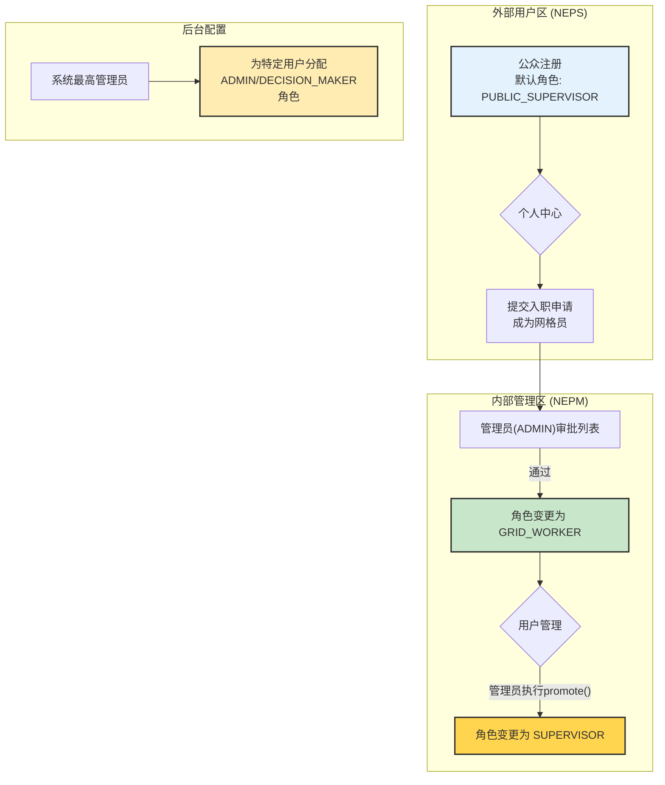
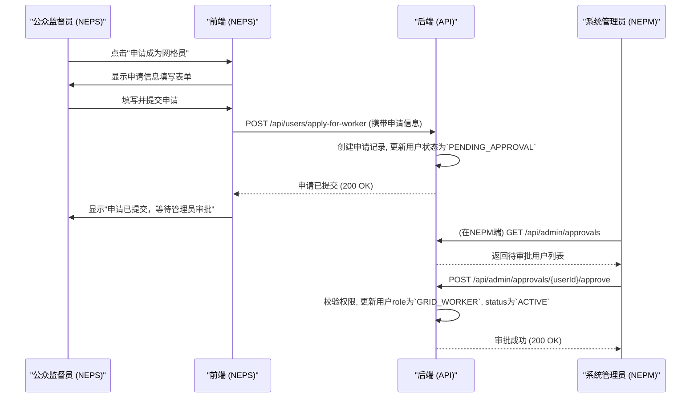
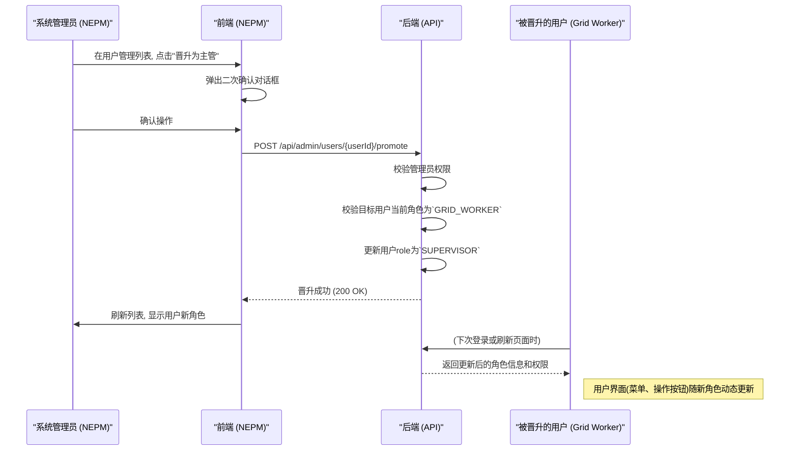

# 角色与晋升体系 - 功能设计文档

## 1. 功能描述
本功能模块定义了系统内所有用户的角色身份、权限边界、以及角色之间的流转路径。它旨在建立一个清晰、安全、易于管理的权限体系，支撑起"公众参与"和"内部管理"两条核心业务线。

## 2. 涉及角色
- **所有角色**: `公众监督员`, `业务主管`, `网格员`, `系统管理员`, `决策者`。
- **核心操作者**: `系统管理员 (ADMIN)` 是执行角色晋升和管理的主要操作者。

## 3. 业务规则

### 3.1 角色定义与权限
- **公众监督员 (PUBLIC_SUPERVISOR)**: 外部用户，只能使用NEPS端，仅能查看和管理自己提交的反馈。
- **业务主管 (SUPERVISOR)**: 内部核心**业务管理者**。使用NEPM管理端，负责其管辖区域内的**任务创建、分配、审核、取消**等全生命周期管理。
- **网格员 (GRID_WORKER)**: 内部核心**任务执行者**。使用NEPG端，负责接收、执行和提交任务。
- **系统管理员 (ADMIN)**: 内部核心**系统维护者**。使用NEPM管理端，负责用户账户管理（审批、创建、晋升）、系统配置等，**不参与日常业务流程**。
- **决策者 (DECISION_MAKER)**: 内部高级观察用户，使用NEPV端，拥有对所有统计和可视化数据的**只读权限**。

### 3.2 角色晋升规则
- 晋升是**单向**的、**逐级**的。
- **禁止跨级晋升**。
- **`PUBLIC_SUPERVISOR` -> `GRID_WORKER` (入职)**: 由用户在NEPS端主动提交申请，经由**系统管理员(ADMIN)**在NEPM端审批通过，代表用户正式成为内部员工。
- **`GRID_WORKER` -> `SUPERVISOR` (晋升)**: 由其直属上级或**系统管理员(ADMIN)**在NEPM端为其执行`promote()`操作，代表从一线执行者晋升为业务管理者。
- **`ADMIN` 与 `DECISION_MAKER`**: 特殊角色，不参与业务晋升流。由系统更高权限的管理员在后台直接配置。

### 3.3 数据模型映射
- **实体关系**: 一个 `User` 实体**拥有一个** `Role` 属性。
- **关键字段**: 角色和状态的管理主要依赖 `user_account` 表中的以下字段：
    - `role` (Enum: `PUBLIC_SUPERVISOR`, `GRID_WORKER`, `SUPERVISOR`, `ADMIN`, `DECISION_MAKER`): 定义用户的角色。
    - `status` (Enum: `PENDING_APPROVAL`, `ACTIVE`, `REJECTED`, `DISABLED`): 定义用户的状态。新申请的用户状态为`PENDING_APPROVAL`，审批通过后为`ACTIVE`。
- **操作**: 角色晋升或状态变更是对 `user_account` 表中特定记录的 `role` 和 `status` 字段的原子更新。

### 3.4 权限矩阵 (Permission Matrix)
| 功能模块 | API 端点 (示例) | `PUBLIC_SUPERVISOR` | `GRID_WORKER` | `SUPERVISOR` | `ADMIN` | `DECISION_MAKER` |
| :--- | :--- | :---: | :---: | :---: | :---: | :---: |
| **公众反馈** | `POST /api/feedback` | C | - | - | - | - |
| | `GET /api/feedback/my` | R | - | - | - | - |
| **任务处理** | `GET /api/worker/tasks` | - | R | - | - | - |
| | `POST /api/worker/tasks/{id}/submit`| - | U | - | - | - |
| **任务管理** | `GET /api/supervisor/tasks` | - | - | R | - | - |
| | `POST /api/supervisor/tasks` | - | - | C | - | - |
| | `PUT /api/supervisor/tasks/{id}` | - | - | U | - | - |
| | `DELETE /api/supervisor/tasks/{id}`| - | - | D | - | - |
| | `POST /api/supervisor/tasks/{id}/approve` | - | - | **Approve** | - | - |
| **用户管理** | `GET /api/admin/users` | - | - | R (下属) | R (全部) | - |
| | `POST /api/admin/users/{id}/promote` | - | - | - | **Promote** | - |
| **入职审批** | `GET /api/admin/approvals` | - | - | - | R | - |
| | `POST /api/admin/approvals/{id}/approve` | - | - | - | **Approve** | - |
| **数据大屏** | `GET /api/data-v/*` | - | - | - | R | R |
| *C=Create, R=Read, U=Update, D=Delete* |

## 4. 功能实现流程

### 4.1 总体晋升流程

### 4.2 申请入职时序图

### 4.3 角色晋升时序图

## 5. API接口设计

### 5.1 用户申请成为网格员
- **URL**: `POST /api/users/apply-for-worker`
- **权限**: `PUBLIC_SUPERVISOR`
- **请求体**: `applicationReason`, `experience`
- **响应**: `200 OK`

### 5.2 管理员获取待审批列表
- **URL**: `GET /api/admin/approvals`
- **权限**: `ADMIN`
- **响应**: `200 OK`, 返回用户申请列表 `[{userId, name, applicationTime, ...}]`

### 5.3 管理员审批
- **URL**: `POST /api/admin/approvals/{userId}/approve` 或 `.../reject`
- **权限**: `ADMIN`
- **请求体**: (可选) `rejectionReason`
- **响应**: `200 OK`

### 5.4 管理员晋升用户
- **URL**: `POST /api/admin/users/{userId}/promote`
- **权限**: `ADMIN`
- **响应**: `200 OK`

## 6. 界面设计要求

### 6.1 NEPS端 (公众监督员)
- 在"个人中心"或"我的"页面，应有一个醒目的入口，如"申请成为网格员"按钮。
- 点击后, 弹出一个表单或新页面, 要求用户填写申请理由、相关经验等附加信息, 并提交。
- 提交后，按钮应变为"审批中..."的不可点击状态。
- 用户的申请状态（待审批、已通过、已驳回）应在个人中心清晰展示。若被驳回，应显示驳回原因。

### 6.2 NEPM端 (管理员 ADMIN)
- 在侧边栏应有"用户管理"和"入职审批"两个菜单项。
- **入职审批页面**: 以列表形式展示所有待审批的申请，包含申请人姓名、申请时间、申请理由等。管理员可点击"通过"或"驳回"。操作后有明确的成功提示，且该条目从列表中移除。
- **用户管理页面**:
    - 以表格形式展示其管辖范围内的所有内部用户列表（包括网格员、主管），并可通过角色、状态进行筛选。
    - 表格的"操作"列中，应包含对符合条件的`GRID_WORKER`的"晋升为主管"按钮。
    - 点击"晋升"按钮，应有二次确认弹窗，明确告知"用户XXX的角色将从GridWorker变更为Supervisor"，防止误操作。操作成功后，该用户的角色信息在表格中应立即更新。