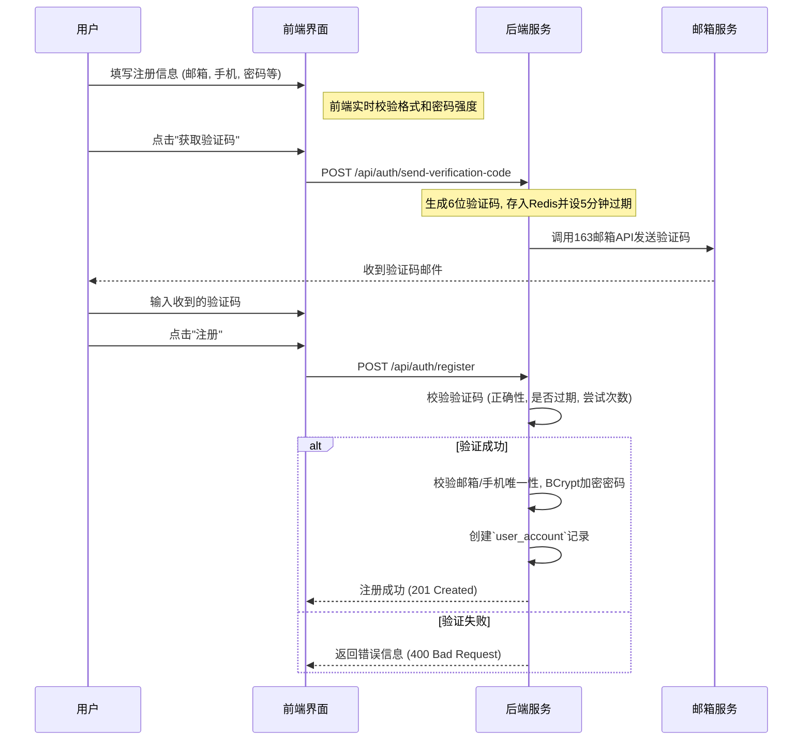
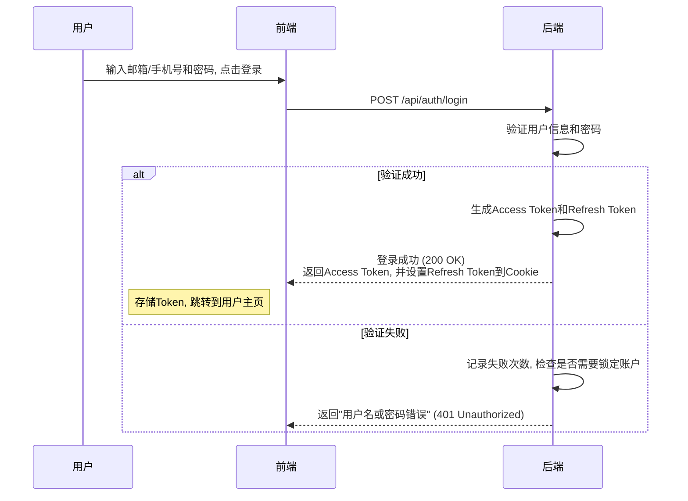
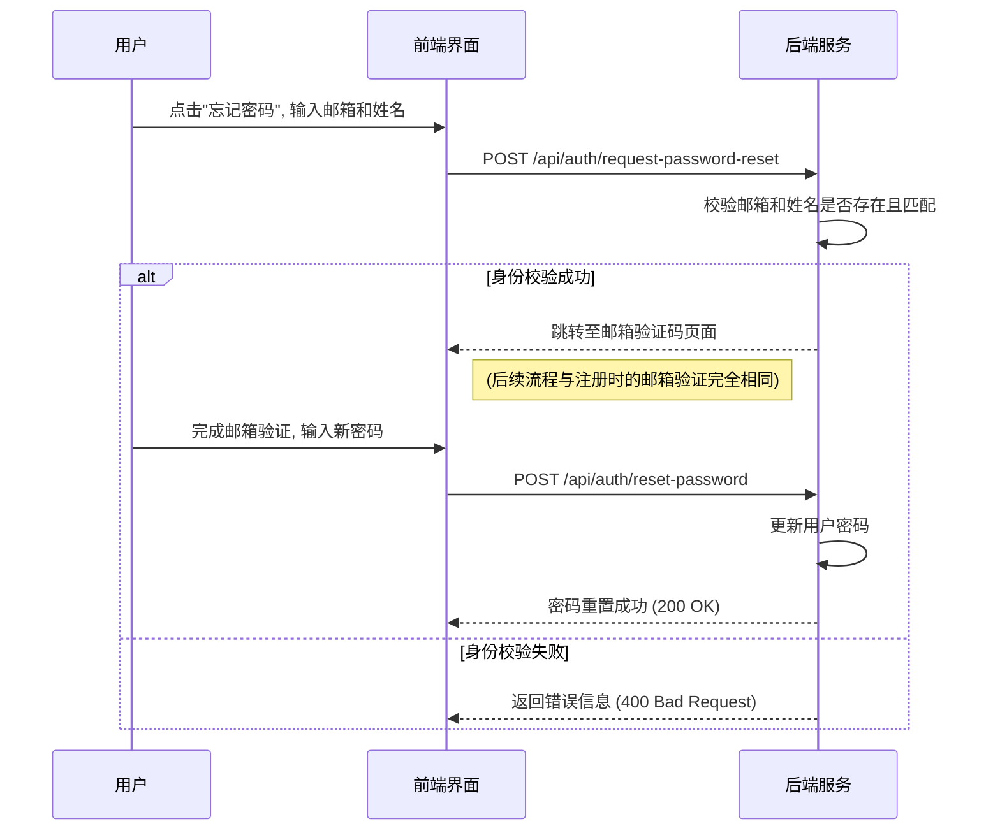

# 账号管理功能 - 设计文档

## 1. 功能描述
本模块负责处理所有用户的认证与基础账户操作，包括注册、登录和安全设置（如忘记密码、修改密码/手机号）。其核心目标是提供一个安全、可靠且用户体验良好的身份验证入口。

## 2. 涉及角色
- **所有角色**: 该功能是所有需要登录系统的用户（公众监督员、监督员、网格员、管理员、决策者）的通用基础功能。

## 3. 业务规则

### 3.1 注册规则
- **唯一性约束**: 注册时使用的`邮箱`和`手机号`必须在`user_account`表中是唯一的。
- **密码策略**:
  - 复杂度: 8-16位，必须同时包含大写字母、小写字母、数字和特殊字符。
  - 确认机制: 注册时密码需要输入两次进行确认。
  - 存储安全: 密码在后端必须使用强哈希算法（如BCrypt）加盐后存储，绝不允许明文存储。
- **邮箱验证码规则**:
  - **时效性**: 验证码生成后5分钟内有效。
  - **冷却期**: "获取验证码"按钮点击后，有60秒的冷却时间，防止恶意请求。
  - **尝试次数**: 同一个验证码最多允许输错2次，第3次输错则该验证码立即失效，需重新获取。

### 3.2 登录规则
- 支持使用`邮箱`或`手机号`作为登录凭据。
- 登录失败时，应给出统一的、模糊的提示（如"用户名或密码错误"），避免泄露账户是否存在的信息。
- 可考虑引入登录尝试次数限制机制，例如连续失败5次后，临时锁定账户15分钟。

### 3.3 安全验证规则
- **身份确认**: "忘记密码"或"修改手机号"等敏感操作，必须先通过"邮箱 + 姓名"进行第一步身份确认。
- **操作授权**: 身份确认通过后，必须再次完成与注册流程完全相同的邮箱动态验证码校验，才能进行下一步操作。

### 3.4 JWT (Token) 规则
- **Payload 结构**: Token的Payload中应至少包含`userId`, `role`, `email`，以便后端进行快速的身份和权限识别。
- **有效期**: Access Token的有效期应设置为较短的时间（如1小时），以降低泄露风险。
- **刷新机制**: 提供一个Refresh Token，其有效期更长（如7天）。当Access Token过期后，前端可使用Refresh Token向后端申请新的Access Token，无需用户重新登录。
- **存储**: 前端应将Access Token存储在内存中，将Refresh Token存储在`HttpOnly`、`Secure`的Cookie中，以提高安全性。

### 3.5 系统管理员操作规则
- **创建内部账户**: 系统管理员(Admin)在NEPM端创建内部用户（如`SUPERVISOR`, `GRID_WORKER`）时，系统应生成一个安全的初始随机密码。
- **密码重置**: 管理员可以为任何用户重置密码，重置后同样生成一个随机密码。
- **密码分发**: 生成的初始密码或重置后的密码，应通过安全的、非系统内的方式（如邮件、短信）告知用户，并强制用户在首次登录后立即修改。

## 4. 功能实现流程

### 4.1 注册流程

### 4.2 登录流程

### 4.3 忘记密码流程

## 5. API 接口设计

### 5.1 用户注册
- **URL**: `POST /api/auth/register`
- **请求体**: `name`, `email`, `phone`, `password`, `verificationCode`
- **响应**: `201 Created`

### 5.2 用户登录
- **URL**: `POST /api/auth/login`
- **请求体**: `principal` (邮箱或手机号), `password`
- **响应**: `200 OK`, 返回 `accessToken`，并在Cookie中设置`refreshToken`。

### 5.3 发送邮箱验证码
- **URL**: `POST /api/auth/send-verification-code`
- **请求体**: `email`, `type` (Enum: `REGISTER`, `RESET_PASSWORD`)
- **响应**: `200 OK`

### 5.4 刷新AccessToken
- **URL**: `POST /api/auth/refresh-token`
- **请求体**: (空, Refresh Token从Cookie中获取)
- **响应**: `200 OK`, 返回新的`accessToken`。

### 5.5 请求密码重置
- **URL**: `POST /api/auth/request-password-reset`
- **请求体**: `email`, `name`
- **响应**: `200 OK` (无论用户是否存在，都返回成功，防止信息泄露)

### 5.6 重置密码
- **URL**: `POST /api/auth/reset-password`
- **请求体**: `email`, `newPassword`, `verificationCode`
- **响应**: `200 OK`

### 5.7 管理员创建用户
- **URL**: `POST /api/admin/users`
- **权限**: `ADMIN`
- **请求体**: `name`, `email`, `phone`, `role`, `region`, `level`
- **响应**: `201 Created`, 返回包含初始随机密码的用户信息。

## 6. 界面设计要求

### 6.1 注册页面
- 表单布局清晰，各输入项有明确的标签和占位提示。
- "获取验证码"按钮在点击后应变为不可用状态，并显示倒计时。
- 密码输入框应为密码类型，并提供一个可切换"显示/隐藏"密码的图标。
- 密码强度提示：实时根据用户输入，以进度条或文字形式提示密码强度（弱、中、强）。
- 所有输入项的错误提示应在输入框下方实时显示，内容明确。

### 6.2 登录页面
- 界面简洁，突出登录表单。
- 提供"忘记密码"的链接。
- 可选提供"记住我"的复选框。
- 登录成功后，应有平滑的过渡效果，并根据用户角色跳转到对应的系统主页（NEPS, NEPG, NEPM, NEPV）。

### 6.3 忘记密码/安全验证页面
- 流程应分步进行，保持每一步操作的单一和清晰。
- 第一步：身份验证（输入邮箱、姓名）。
- 第二步：安全验证（输入邮箱收到的验证码）。
- 第三步：重置密码（输入新密码并确认）。
- 每个步骤都应有清晰的标题和进度指示。
- 操作成功后，应明确提示用户"密码已重置，请使用新密码登录"，并引导至登录页面。 